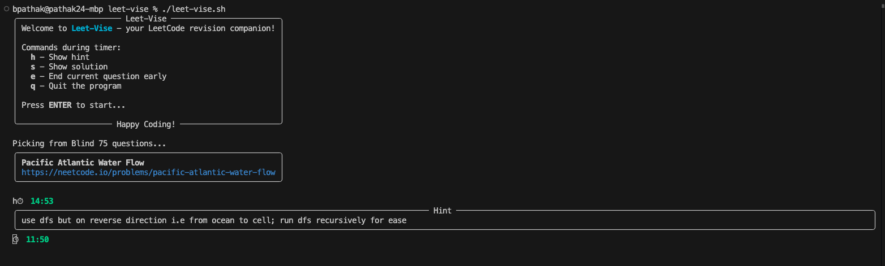

# **Leet-Vise**  
_A lightweight CLI tool to practice and revise your LeetCode questions._

---

## Introduction

**Leet-Vise** is your personal **LeetCode revision companion**.  
It fetches coding problems from your **Notion database**, stores them locally as JSON, and then lets you **practice them directly in your terminal** — complete with hints, solutions, and a countdown timer.  

You’ll need to **use the provided Notion template** for storing your questions.  As you solve problems on LeetCode (or elsewhere), **log them in your Notion database** with details like title, link, difficulty, hint, and solution. Later, Leet-Vise will pull from this list to pick random problems for you to revise. Then you can just open the link and start practicing. 

You can run it purely offline (using your cached data) or update the questions anytime from Notion with a single command.  

Perfect for:
- 🔄 Consistent revision without distractions  
- 💻 Practicing from your own curated problem list  
- ⏳ Staying focused with a live custom timer 
 
---

## Features

- **Fetch & cache questions** from Notion API  
- **Random question picker** for unbiased practice  
- **Interactive commands during timer**:  
  - `h` → Show hint  
  - `s` → Show solution  
  - `e` → End current question early  
  - `q` → Quit the program  
- **Live countdown timer** in the terminal

---

## 🚀 How to Run

### 1️. Clone the repo
```bash
git clone https://github.com/YOUR_USERNAME/leet-vise.git
cd leet-vise
```

### 2. Run the setup script
```bash
./setup.sh
```

### 3. Setup Notion API (for your custom data)
- Create a Notion integration at https://www.notion.so/my-integrations
- Copy the Internal Integration Token
- Share your target Notion Database with this integration
- Copy the Database ID from your Notion database URL
- Add them to `.env` in the project root

### 4. Import data (optional)
```bash
./import.sh
```

### 5. Start practicing
```bash
./leet-vise.sh
```

## Important links
[Notion Leetcode Tracker Template](https://www.notion.so/marketplace/templates/leetcode-problem-tracker?cr=pro%253Asanskriti)

[Notion Api Docs](https://developers.notion.com/docs/getting-started)

## Screenshot
